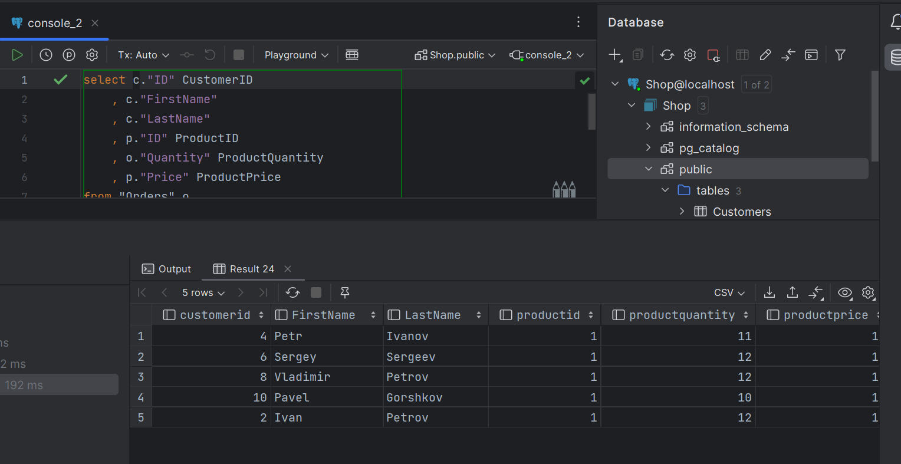

# 40 Индексы: кластерный и не кластерный  // ДЗ

Индексы: кластерный и не кластерный

## Цель
Тренируем навык работы с таблицами, связями между ними индексами

## Описание/Пошаговая инструкция выполнения домашнего задания
* В СУБД PostgreSQL создать БД `Shop`
* Создать таблицы `Customers` (`ID`, `FirstName`, `LastName`, `Age`), `Products` (`ID`, `Name`, `Description`, `StockQuantity`, `Price`) и `Orders` (`ID`, `CustomerID`, `ProductID`, `Quantity`)
* Установить между ними соответствующие связи по внешним ключам (в каждой таблице поле ID является первичным ключом)
* Заполнить таблицы произвольными значениями (с корректными значениями для внешних ключей). В каждой таблице не менее 10 записей.
* Написать запрос, который возвращает список всех пользователей старше 30 лет, у которых есть заказ на продукт с `ID=1`. Используйте `alias`, чтобы дать столбцам в результирующей выборке понятные названия. В результате должны получить таблицу: `CustomerID`, `FirstName`, `LastName`, `ProductID`, `ProductQuantity`, `ProductPrice`
* Убедитесь, что вы повесили необходимый некластерный индекс (он не особо нужен, когда у вас 10 записей, но пригодится, если бы их было 1000)

## Критерии оценки
* Задание выполнено - 10 баллов
* Задание не выполнено - 0 баллов

Рекомендуем сдать до: 17.01.2023

## Решение
Подготовлен `compose.yml` который поднимает PostgreSQL, создает структуру БД и наполняет её тестовыми данными.

SQL запрос:
```sql
select c."ID" CustomerID
    , c."FirstName"
    , c."LastName"
    , p."ID" ProductID
    , o."Quantity" ProductQuantity
    , p."Price" ProductPrice
from "Orders" o
join "Customers" c on o."CustomerID" = c."ID"
join "Products" p on o."ProductID" = p."ID"
where c."Age" > 30
    and p."ID" = 1;
```


